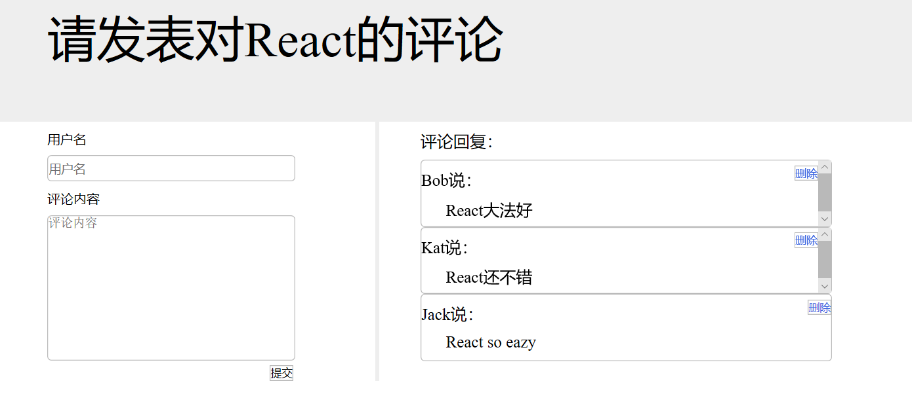

## 1.notebook为React的一些基本应用及示例，包含：
* 如何渲染html
* 遍历数组
* 定义组件
* 三大属性
  + props
  + refs
  + state
* 受控组件
* 生命周期
* ajax

## 2.react-cli脚手架
* src_cli利用脚手架搭建的一个简单评论系统，如图

* src_router为路由的使用
##### 每个文件夹下的readMe为笔记，将文件夹名字改为src即可使用